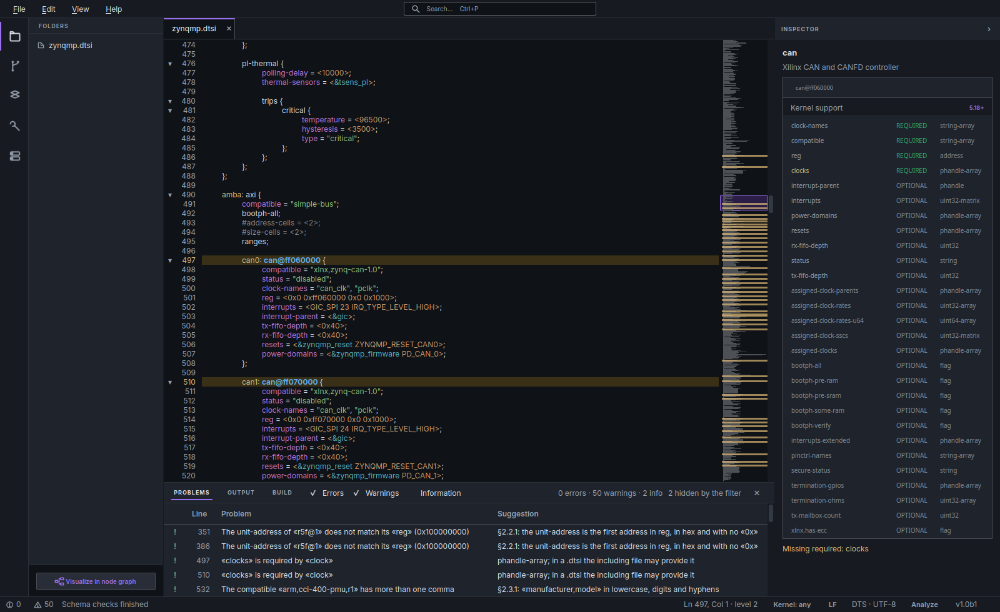
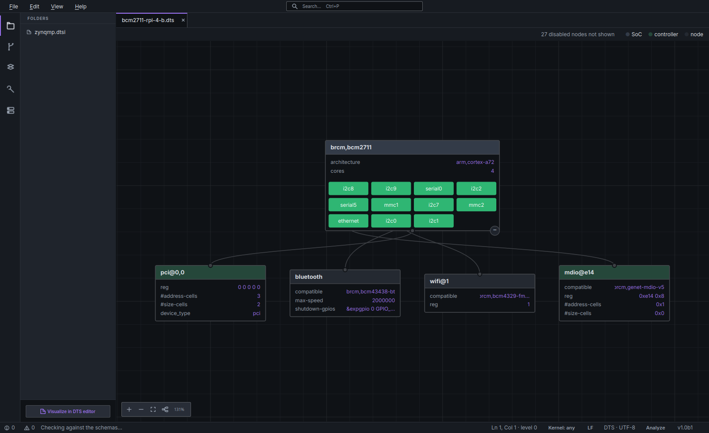
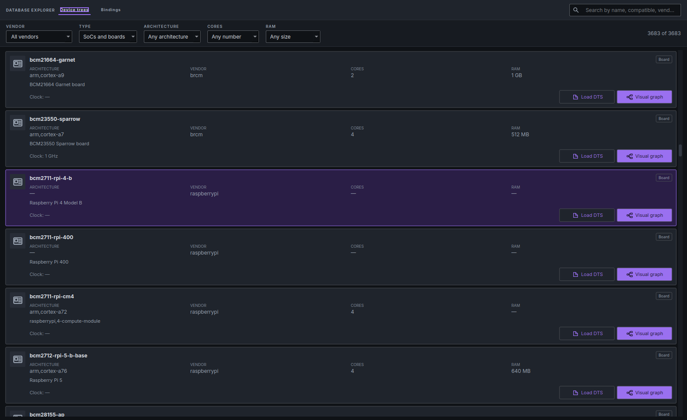
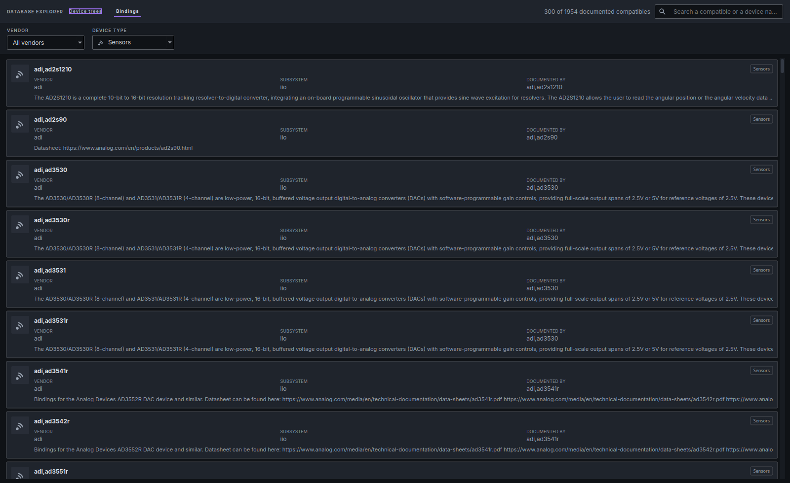

<h1 align="center">DTstudio</h1>

<p align="center"><strong>Edit Linux Device Trees without fighting the syntax.</strong></p>

<p align="center">
  <a href="https://github.com/serg4life/dtstudio-releases/releases/latest"></a>
  
  
  <a href="https://dt-studio.dev"></a>
</p>

<p align="center">
  <a href="https://github.com/serg4life/dtstudio-releases/releases/latest/download/dtstudio_amd64.deb"><strong>⬇ Download for Linux (.deb)</strong></a>
  &nbsp;·&nbsp;
  <a href="https://dt-studio.dev">Official site</a>
</p>



DTstudio is a desktop app for Linux Device Trees. Open a `.dts`, see what every
node actually needs, fix what's wrong before it reaches the board, draw the tree
as a graph, and build overlays — all checked live against the kernel's own
bindings.

It is in **beta and completely free**. No account, no telemetry: your files
never leave your machine.

## Install

```bash
wget https://github.com/serg4life/dtstudio-releases/releases/latest/download/dtstudio_amd64.deb
sudo apt install ./dtstudio_amd64.deb
```

Then launch **DTstudio** from the applications menu, or run `dtstudio`.

The bindings database (~80 MB) is downloaded on first run — no need to fetch it
by hand.

**Requirements:** a Debian or Ubuntu based distribution on x86_64, and
`libxcb-cursor0` (pulled in by `apt`). `device-tree-compiler` and `cpp` come in
as recommends and are what compiling and decompiling use; everything else works
without them.

## What you can do with it

### Validation as you type

Errors and warnings the moment you stop typing, each with the line, what's wrong
and what to write instead — from a missing required property to a unit-address
that doesn't match its `reg`. Put the cursor in a node and the inspector says
what its `compatible` is, which properties it requires, which it accepts, their
types, and the kernel version from which the device is supported.

### The tree, drawn



Your device tree as a graph: the SoC with its controllers, and what hangs off
each one. Jump between the graph and the source without losing your place.

### A catalogue of hardware…



3,600+ SoCs and boards to search by name, vendor, architecture, cores or RAM —
open any of them straight into the editor or the graph instead of hunting
through a kernel tree.

### …and of bindings



Next to it, 25,000+ device bindings searchable by vendor and device type: what
the kernel documents about a part, without leaving the editor to grep for it.

### Overlays, built and compiled

Click the node you want to change, tick the properties, and the overlay writes
itself. Validate it against the base tree — a target that doesn't exist is
caught here, not on the board. Export it as `.dtso`, compile it to `.dtbo`,
decompile a `.dtb` back to source, or take just the DTS fragment or a JSON model
of the tree.

## What is in a release

| Asset | What it is |
|---|---|
| `dtstudio_amd64.deb` | The Linux package. The name carries no version, so `releases/latest/download/dtstudio_amd64.deb` always points at the current build. |
| `bindings.db` | The device-tree bindings database, built from the kernel YAML bindings. |
| `manifest.json` | Version, URL, `sha256` and size of `bindings.db`. DTstudio reads it to fetch and verify the database. |

This repository carries distribution assets only — the application source lives
elsewhere.

`bindings.db` is built from the Linux kernel's own device tree bindings and
sources, which keep their own licences (GPL-2.0 and dual GPL/MIT/BSD variants).
The database itself — its compilation, schemas and index — is DTstudio's own
work and is supplied for use with the application. See [NOTICE.md](NOTICE.md).

## Something broken?

It is a beta: expect rough edges, and tell us what breaks. A device tree that
doesn't open, a check that fires when it shouldn't, a message that makes no
sense — that is exactly what a beta is for.

**[serg4life@duck.com](mailto:serg4life@duck.com)** · [dt-studio.dev](https://dt-studio.dev)
